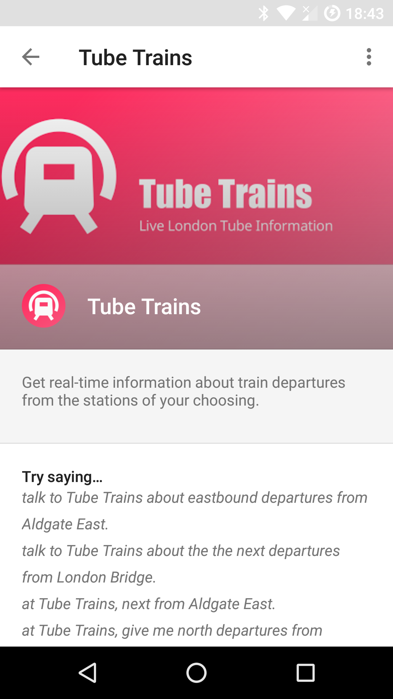

# Tube Trains - Google Home Action


Fulfilment for an [api.ai](https://api.ai/) -powered [Actions on Google](https://developers.google.com/actions/) integration
that provides live departure times through a Google Home.

## Using

This is deployed and live! If you have a Google Home, ask activate it by saying

> Hey Google, let me talk to Tube Trains.

You can also ask it in one go:

> Hey Google, ask Tube Trains about the next departures from Euston Square.

Or something a bit more involved:

> Hey Google, at Tube Trains, tell me about the next eastbound departures on the Hammersmith & City Line from Aldgate East.

You can see it in action here:

[](https://twitter.com/passy/status/843184619935715332)

You can also find it under the available services in the Google Home app:



## Building and Testing

Automated testing is limited at this point, types have provided sufficient help so far.

Some limited test fixtures are available for manual testing:

```
stack build
stack exec tube-bot-fulfillment

curl -vv 'http://localhost:8001/webhook' -XPOST -H "Content-Type: application/json" -d @data/test_req.json
```

There's also a small test suite you can run with `stack test`.

### Building the docker image

There's a Docker image for easier deployment, which simply wraps a statically linked
binary.

In order to build the container, please first build the static binary.

```
./build-static.sh
docker build --rm -t passy/tube-bot-fulfillment:vx.y.z .
docker push passy/tube-bot-fulfillment:vx.y.z
```

## Deployment

I use this [docker-compose](https://github.com/passy/tube-bot-fulfillment-deployment) config file
that I check out and run on my VPS. Maybe that'll do for you as well.
